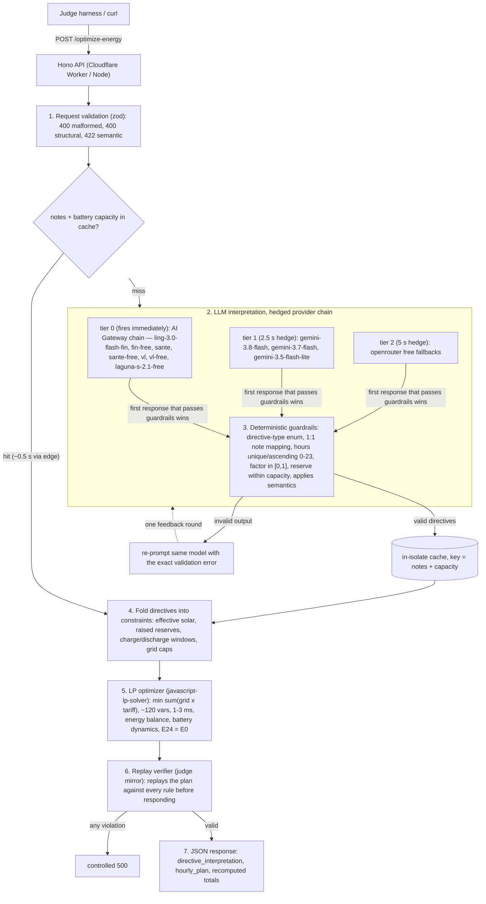

# GridWise LLM: smart campus energy optimization

BUP CSE Fest 2026 Hackathon, Online Preliminary Round.

This service exposes one HTTP API. It reads a 24-hour energy scenario plus 1 to 3
natural-language operator notes, interprets the notes with an LLM, and returns the
interpretation together with a valid, cost-optimal 24-hour schedule covering grid
import, solar usage, and battery actions.

## Architecture

### Pipeline



### Why the design uses both an LLM and deterministic code

The Problem Statement requires this split: "Human notes are not directly trusted as
math. They are first converted to a fixed structured format, checked by guardrails,
and only then applied to the optimization model."

**The LLM does what deterministic code cannot.** It understands free-form language.
"PV production will drop to about 20% between 13:00 and 15:00" and "Expect an 80%
reduction during the 1-3 PM maintenance window" describe the same directive in
different words. Hidden cases are paraphrases by design, and the rubric marks
hard-coded phrase matching as non-compliant. The LLM is mandatory in this path, and
its structured output becomes the optimizer's constraints. This is what the 25
interpretation points measure.

**Deterministic code does what the LLM cannot.** Guardrails, the optimizer, and the
verifier compute exactly. The judge replays the returned schedule hour by hour and
checks every energy, battery, and directive rule. An LLM doing this math would
produce schedules that fail replay. These checks carry the other 75 points.

The interpretation step is non-deterministic because language is ambiguous. The
schedule step is deterministic for a given interpretation, which is what makes the
judge's replay meaningful.

### Caching

| Aspect | Behavior                                                                                                                                                                                                                                          |
| ------ | ------------------------------------------------------------------------------------------------------------------------------------------------------------------------------------------------------------------------------------------------- |
| Key    | FNV hash of `battery.capacity_kwh` plus the operator notes. Capacity belongs in the key because percentage-based reserves ("keep 50% of capacity") convert through it. Identical notes under a different capacity are a different interpretation. |
| Effect | Repeat scenarios skip the LLM. Measured 21-37 ms warm versus 2-8 s cold.                                                                                                                                                                          |
| Scope  | Per Worker isolate, in-memory `Map`. No cross-isolate sharing, no persistence, no TTL.                                                                                                                                                            |

### Failure handling

| Failure                                  | Behavior                                                                            |
| ---------------------------------------- | ----------------------------------------------------------------------------------- |
| Malformed JSON, bad schema               | `400` or `422` with details. The service stays up.                                  |
| LLM emits invalid structure              | Guardrails reject it and the model is re-prompted with the exact error.             |
| One model or provider slow or down       | A later tier answers. Worst case is about 20 s against the 30 s judge cap.          |
| Every LLM attempt fails                  | Controlled `500`. The service does not invent directives.                           |
| LP infeasible or self-verification fails | Controlled `500`. A schedule that violates the rules is not returned.               |

### Stack

| Layer        | Technology                                                                                                                                                                                                                                   |
| ------------ | -------------------------------------------------------------------------------------------------------------------------------------------------------------------------------------------------------------------------------------------- |
| HTTP server  | Hono on Cloudflare Workers, or Node via `@hono/node-server`                                                                                                                                                                                  |
| LLM access   | Vercel AI Gateway, Gemini API, and OpenRouter through the Vercel AI SDK (`generateText` plus tolerant JSON extraction)                                                                                                                      |
| Models       | AI Gateway chain raced immediately: `inclusionai/ling-3.0-flash-fin`, `-fin-free`, `-sante`, `-sante-free`, `-vl`, `-vl-free`, `poolside/laguna-s-2.1-free`. Gemini chain hedged 2.5 s later: `gemini-3.8-flash`, `gemini-3.7-flash`, `gemini-3.5-flash-lite` (thinking disabled). OpenRouter chain hedged 5 s later: `inclusionai/ling-3.0-flash-sante:free`, `openrouter/free` |
| Guardrails   | Hand-written deterministic validators with zod                                                                                                                                                                                               |
| Optimizer    | `javascript-lp-solver`, exact LP Simplex, ~120 variables, 1-3 ms                                                                                                                                                                             |
| Verification | Deterministic schedule replay mirroring the judge                                                                                                                                                                                            |
| Deployment   | `wrangler deploy`, Docker fallback image                                                                                                                                                                                                     |

## API

- `GET /health` returns `{"status":"ok"}`.
- `POST /optimize-energy` accepts the scenario JSON (`scenario_id`, `operator_notes`
  with 1-3 strings, `hours` with 24 demand/solar/tariff entries, `battery`) and
  returns `scenario_id`, `directive_interpretation`, `hourly_plan`,
  `total_grid_kwh`, `total_cost_bdt`, `peak_grid_kwh`, and `plan_summary` per the
  Problem Statement.

Error responses are controlled JSON. `400 malformed_json` for an unparseable body,
`400 invalid_request` for structural violations, `422 semantically_invalid` for a
well-formed but inconsistent request such as duplicate or missing hours, and
`500 internal_error` otherwise. No stack traces and no secrets appear in responses.

## Environment variables

| Name                           | Required         | Description                                                                                                                                                                            |
| ------------------------------ | ---------------- | -------------------------------------------------------------------------------------------------------------------------------------------------------------------------------------- |
| `AI_GATEWAY_API_KEY`           | at least one key | Vercel AI Gateway key. Primary provider. Keep it secret.                                                                                                                               |
| `GOOGLE_GENERATIVE_AI_API_KEY` | at least one key | Gemini API key. First fallback. Keep it secret.                                                                                                                                        |
| `OPENROUTER_API_KEY`           | at least one key | OpenRouter API key. Last fallback. Keep it secret.                                                                                                                                     |
| `AI_GATEWAY_MODELS`            | no               | Comma-separated gateway chain. Defaults to `inclusionai/ling-3.0-flash-fin,inclusionai/ling-3.0-flash-fin-free,inclusionai/ling-3.0-flash-sante,inclusionai/ling-3.0-flash-sante-free,inclusionai/ling-3.0-flash-vl,inclusionai/ling-3.0-flash-vl-free,poolside/laguna-s-2.1-free`. |
| `GEMINI_MODELS`                | no               | Comma-separated Gemini chain. Defaults to `gemini-3.8-flash,gemini-3.7-flash,gemini-3.5-flash-lite`.                                                                                   |
| `OPENROUTER_MODELS`            | no               | Comma-separated OpenRouter chain override.                                                                                                                                             |
| `PORT`                         | no               | Listen port for the Node and Docker entry. Defaults to 3000.                                                                                                                           |

All three keys may be set. Each request fires the AI Gateway chain immediately,
the Gemini chain 2.5 s later, and the OpenRouter chain 5 s later. Unconfigured
tiers are skipped, so the next configured tier starts at zero. The first
response that passes guardrails wins.

## Local quickstart

Prerequisite: [Bun](https://bun.sh) v1.4 or later.

```bash
git clone <repo-url> && cd BUP_HACKATHON
bun install

# The .env file is git-ignored. Set at least one provider key.
printf 'AI_GATEWAY_API_KEY=vck_...\nGOOGLE_GENERATIVE_AI_API_KEY=AQ...\nOPENROUTER_API_KEY=sk-or-...\n' > apps/server/.env

# Start the API on http://localhost:3000
bun run dev

# In another terminal:
curl http://localhost:3000/health
# {"status":"ok"}
```

Run one public sample case against the local server:

```bash
cd apps/server
python3 -c "
import json, urllib.request
pack = json.load(open('../../BUP_CSE_FEST_2026_Participant_Docs/BUP_CSE_FEST_2026_Preli_Public_Sample_Cases.json'))
req = urllib.request.Request('http://localhost:3000/optimize-energy',
  data=json.dumps(pack['cases'][0]['input']).encode(),
  headers={'content-type':'application/json'})
print(json.dumps(json.load(urllib.request.urlopen(req)), indent=2)[:800])
"
```

## Public sample test

```bash
cd apps/server
bun run test:samples
```

The harness boots the server on port 3100, POSTs all 10 public cases, and mirrors
the judge. It compares the interpretation against ground truth, replays the plan
against both our interpretation and the expected one, recomputes the totals, and
compares cost against the reference optimum. Expected result: `10 passed, 0 failed`
with a cost ratio of 1.0000 per case.

The optimizer alone, without the LLM, reproduces the reference optimal cost on all
10 public cases exactly and solves each scenario in 1-3 ms.

## Deployment on Cloudflare Workers

```bash
cd apps/server
bunx wrangler login                                   # one-time
bunx wrangler secret put AI_GATEWAY_API_KEY           # AI Gateway key
bunx wrangler secret put GOOGLE_GENERATIVE_AI_API_KEY # Gemini key
bunx wrangler secret put OPENROUTER_API_KEY           # OpenRouter key
bun run deploy                                        # wrangler deploy
```

The worker name is `gridwise-llm`. The live deployment answers at
`https://gridwise-llm.seyamalam41.workers.dev`. The model chains are set
through `vars` in `wrangler.jsonc`. Override one without redeploying with
`bunx wrangler secret put <NAME>_MODELS`.

## Docker fallback

Pullable image on Docker Hub (linux/amd64 and linux/arm64):

```
docker.io/touhidulalam41/gridwise-llm:1.2.0
digest: sha256:a49438f95ebd230d4744c0e76b4fc5f7fd4c81e97da05ecd78fee4f6116aef42
```

```bash
docker pull docker.io/touhidulalam41/gridwise-llm:1.2.0
docker run --rm -p 3000:3000 \
  -e AI_GATEWAY_API_KEY=vck_... \
  -e GOOGLE_GENERATIVE_AI_API_KEY=AQ... \
  -e OPENROUTER_API_KEY=sk-or-... \
  docker.io/touhidulalam41/gridwise-llm:1.2.0
curl http://localhost:3000/health
# {"status":"ok"}
```

Or build from source:

```bash
docker build -t gridwise-llm:latest .
docker run --rm -p 3000:3000 \
  -e AI_GATEWAY_API_KEY=vck_... \
  -e GOOGLE_GENERATIVE_AI_API_KEY=AQ... \
  -e OPENROUTER_API_KEY=sk-or-... \
  gridwise-llm:latest
```

The image bundles the server into one file with `bun build` and binds to
`0.0.0.0:3000`. It contains no secrets. API keys are runtime variables.

## Repository layout

```
apps/server/
  src/index.ts          Hono app: /health, /optimize-energy, controlled errors
  src/schema.ts         Zod request contract and shared types
  src/llm.ts            LLM interpretation, provider race, cache
  src/guardrails.ts     Deterministic validation of LLM output
  src/optimizer.ts      Effective-scenario builder and LP solver
  src/verifier.ts       Judge-mirror replay verifier
  src/config.ts         Runtime env (Worker bindings or process.env)
  src/node-entry.ts     Node/Bun entry for Docker and local dev
  scripts/test-samples.ts   Public sample harness
  wrangler.jsonc        Cloudflare Worker config
Dockerfile              Fallback image, multi-stage bun build
```

## Dependencies

Direct dependencies: `hono`, `@hono/node-server`, `ai` (Vercel AI SDK,
including the AI Gateway provider), `@ai-sdk/google`,
`@openrouter/ai-sdk-provider`, `javascript-lp-solver`, `zod`. Dev dependencies:
`wrangler`, `typescript`, `@types/bun`. Built with AI coding assistance. All
libraries are credited per their licenses.

## Known limitations

- Free-tier models have provider-side rate limits (the OpenRouter free daily cap is
  the tightest). The service races the AI Gateway chain with Gemini and
  OpenRouter as hedged fallbacks, but if every provider is exhausted the
  request ends in a controlled 500. Paid keys or different models can be set
  through the environment for heavier load.
- The interpretation cache lives per Worker isolate, so it does not share across
  isolates.
- Solar curtailment is free and grid export is not modeled, both per the spec.

## Security

No secrets appear in the repository, logs, or API responses. `.env` is git-ignored,
the Cloudflare keys are stored with `wrangler secret`, and the Docker image receives
keys at runtime only. LLM output passes deterministic validation before it can
influence the schedule.
