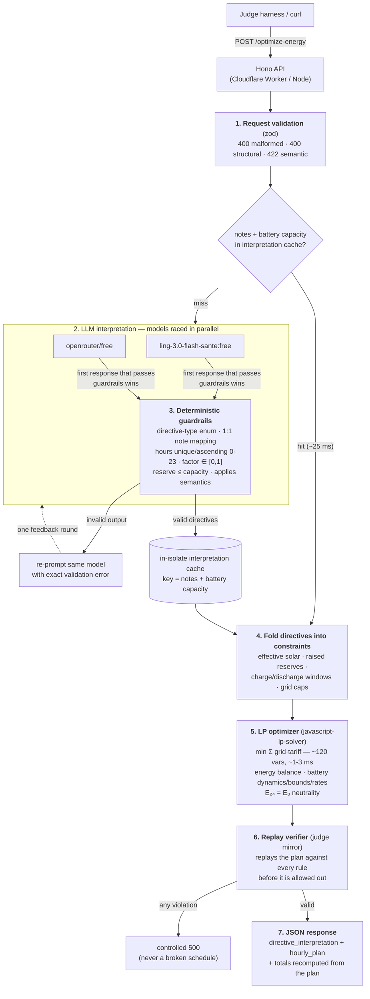

# GridWise LLM — Smart Campus Energy Optimization

BUP CSE Fest 2026 Hackathon · Online Preliminary Round

One HTTP API service that interprets natural-language operator notes with an LLM,
validates the interpretation deterministically, and returns a valid, cost-optimal
24-hour campus energy schedule (grid + solar + battery).

## Architecture

### End-to-end pipeline



### Why LLM _and_ deterministic code? (the point of each)

The Problem Statement mandates exactly this split: _"Human notes are not directly
trusted as math. They are first converted to a fixed structured format, checked by
guardrails, and only then applied to the optimization model."_

- **The LLM does what deterministic code cannot**: understand free-form language.
  _"PV production will drop to about 20% between 13:00 and 15:00"_ and _"Expect an
  80% reduction during the 1-3 PM maintenance window"_ are the same directive in
  different words — hidden cases are paraphrases by design, and hard-coded phrase
  matching is explicitly non-compliant. This is why the LLM is **mandatory** in the
  interpretation path (it earns the 25 interpretation points).
- **Deterministic code does what the LLM cannot**: exact math. Guardrails, the LP
  optimizer, and the replay verifier never guess — they guarantee the returned
  schedule obeys every energy/battery/directive rule the judge independently replays
  (the other 75 points). The LLM never touches the math; it only emits structured
  directives that become optimizer constraints.

So: the **interpretation is non-deterministic** (that's the LLM earning its keep on
language), the **schedule is deterministic given an interpretation** (that's what
makes the judge's replay meaningful), and **the LLM requirement is satisfied in the
path that matters** — not just for cosmetic text.

### Caching

| Layer                | Behavior                                                                                                                                                                                                                                                                |
| -------------------- | ----------------------------------------------------------------------------------------------------------------------------------------------------------------------------------------------------------------------------------------------------------------------- |
| Interpretation cache | In-isolate `Map`, key = FNV-hash of `battery.capacity_kwh + operator_notes`. Capacity is part of the key because percentage-based reserves (_"keep 50% of capacity"_) convert through it — identical notes under a different capacity are a _different_ interpretation. |
| Effect               | Repeat scenarios skip the LLM entirely: **~25 ms** responses on a warm isolate (measured 21-37 ms vs 2-8 s cold).                                                                                                                                                       |
| Scope                | Per Worker isolate (best-effort, no cross-isolate sharing); no persistence, no TTL — entries are tiny (a few directives).                                                                                                                                               |

### Failure handling (safe by construction)

| Failure                                 | Behavior                                                     |
| --------------------------------------- | ------------------------------------------------------------ |
| Malformed JSON / bad schema             | `400` / `400` / `422` with details, never a crash            |
| LLM emits invalid structure             | Guardrails reject → model re-prompted with the exact error   |
| LLM/provider down or slow               | Other raced model answers; total worst case ~20 s (30 s cap) |
| Every LLM attempt fails                 | Controlled `500`, no invented directives                     |
| LP infeasible / self-verification fails | Controlled `500` — a wrong schedule is never returned        |

### Stack

| Layer                     | Technology                                                               |
| ------------------------- | ------------------------------------------------------------------------ |
| HTTP server               | Hono (Cloudflare Workers / Node via `@hono/node-server`)                 |
| LLM                       | OpenRouter via Vercel AI SDK (`generateText` + tolerant JSON extraction) |
| Models (free tier, raced) | `inclusionai/ling-3.0-flash-sante:free` ⚡ `openrouter/free`             |
| Guardrails                | Hand-written deterministic validators (zod + rule checks)                |
| Optimizer                 | `javascript-lp-solver` — exact LP Simplex, ~120 vars, ~1-3 ms            |
| Verification              | Deterministic schedule replay mirroring the judge's checks               |
| Deployment                | Cloudflare Workers (`wrangler deploy`), Docker fallback image            |

## API

- `GET /health` → `{"status":"ok"}`
- `POST /optimize-energy` — accepts the scenario JSON (`scenario_id`, `operator_notes` (1-3),
  `hours` (24 × demand/solar/tariff), `battery`) and returns `scenario_id`,
  `directive_interpretation`, `hourly_plan`, `total_grid_kwh`, `total_cost_bdt`,
  `peak_grid_kwh`, `plan_summary` per the Problem Statement.

Errors are controlled JSON: `400 malformed_json` (unparseable body) /
`400 invalid_request` (structurally invalid) / `422 semantically_invalid`
(well-formed but inconsistent, e.g. duplicate/missing hours) /
`500 internal_error` — no stack traces, no secrets.

## Environment variables

| Name                 | Required  | Description                                           |
| -------------------- | --------- | ----------------------------------------------------- |
| `OPENROUTER_API_KEY` | yes       | OpenRouter API key (secret — never committed)         |
| `OPENROUTER_MODELS`  | no        | Comma-separated model chain override (defaults above) |
| `PORT`               | no (Node) | Listen port for the Node/Docker entry (default 3000)  |

## Local quickstart (clean environment)

Prerequisites: [Bun](https://bun.sh) v1.4+.

```bash
git clone <repo-url> && cd BUP_HACKATHON
bun install

# Configure the key (file is git-ignored):
printf 'OPENROUTER_API_KEY=sk-or-...\n' > apps/server/.env

# Start the API (Node entry, http://localhost:3000):
bun run dev

# In another terminal:
curl http://localhost:3000/health
# => {"status":"ok"}
```

Run one public sample case against the local server:

```bash
cd apps/server
python3 -c "
import json, urllib.request
pack = json.load(open('../../BUP_CSE_FEST_2026_Participant_Docs/BUP_CSE_FEST_2026_Preli_Public_Sample_Cases.json'))
req = urllib.request.Request('http://localhost:3000/optimize-energy',
  data=json.dumps(pack['cases'][0]['input']).encode(),
  headers={'content-type':'application/json'})
print(json.dumps(json.load(urllib.request.urlopen(req)), indent=2)[:800])
"
```

## Public sample test procedure (expected result)

```bash
cd apps/server
bun run test:samples
```

This boots the server on `:3100`, POSTs all 10 public cases, and mirrors the judge:
interpretation vs ground truth, plan replayed against both our and the expected
interpretations, totals recomputation, and cost ratio vs the reference optimum.
**Expected:** `10 passed, 0 failed`, cost ratio 1.0000 per case.

The optimizer alone (no LLM) reproduces the reference optimal cost on all 10 public
cases exactly (ratio 1.0000), in ~1-3 ms per scenario.

## Deployment (Cloudflare Workers)

```bash
cd apps/server
bunx wrangler login                              # one-time
bunx wrangler secret put OPENROUTER_API_KEY    # store the key as a secret
bun run deploy                                  # wrangler deploy
```

The worker name is `gridwise-llm`; wrangler prints the public
`https://gridwise-llm.<account>.workers.dev` URL. Free-tier model chain is configured
via `vars.OPENROUTER_MODELS` in `wrangler.jsonc` (override without redeploying with
`bunx wrangler secret put OPENROUTER_MODELS`).

## Docker fallback

Pullable registry reference (Docker Hub):

```
docker.io/touhidulalam41/gridwise-llm:1.0.0
digest: sha256:6b7df6c7457f8d98709d70a6b0d7d337cc89efc0c7bc6eb915def282ce3e585e
```

```bash
docker pull docker.io/touhidulalam41/gridwise-llm:1.0.0
docker run --rm -p 3000:3000 -e OPENROUTER_API_KEY=sk-or-... \
  docker.io/touhidulalam41/gridwise-llm:1.0.0
curl http://localhost:3000/health
# => {"status":"ok"}
```

Or build from source:

```bash
docker build -t gridwise-llm:latest .
docker run --rm -p 3000:3000 -e OPENROUTER_API_KEY=sk-or-... gridwise-llm:latest
```

The image builds a single-file bundle (`bun build`) and binds to `0.0.0.0:3000`.
No secrets are baked into the image; `OPENROUTER_API_KEY` is a runtime env var.

## Repository layout

```
apps/server/
  src/index.ts        Hono app: /health, /optimize-energy, controlled errors
  src/schema.ts       Zod request contract + shared types
  src/llm.ts          OpenRouter structured interpretation + model chain + cache
  src/guardrails.ts   Deterministic validation/normalization of LLM output
  src/optimizer.ts    Effective-scenario builder + LP formulation/solve
  src/verifier.ts     Judge-mirror replay verifier
  src/config.ts       Runtime env (Worker bindings / process.env)
  src/node-entry.ts   Node/Bun entry (Docker + local dev)
  scripts/test-samples.ts   Public sample harness
  wrangler.jsonc      Cloudflare Worker config
Dockerfile            Fallback image (multi-stage bun build)
```

## Dependencies (direct)

`hono`, `@hono/node-server`, `ai` (Vercel AI SDK), `@openrouter/ai-sdk-provider`,
`javascript-lp-solver`, `zod`; dev: `wrangler`, `typescript`, `@types/bun`.
Built with AI coding assistance. All libraries credited per their licenses.

## Known limitations

- Free-tier OpenRouter models have provider-side rate limits; the service retries and
  falls back across the configured chain, but an exhausted chain returns a controlled 500.
  Provide your own key / paid model via `OPENROUTER_MODELS` for production stability.
- The in-isolate interpretation cache is best-effort (per Worker isolate).
- Solar curtailment is free (per spec); grid export is not modeled (per spec).

## Security

No secrets in the repository, logs, or API responses. `.env` is git-ignored; the
Cloudflare key lives in `wrangler secret`; Docker receives keys at runtime only.
LLM output is validated deterministically before it can influence the schedule.
